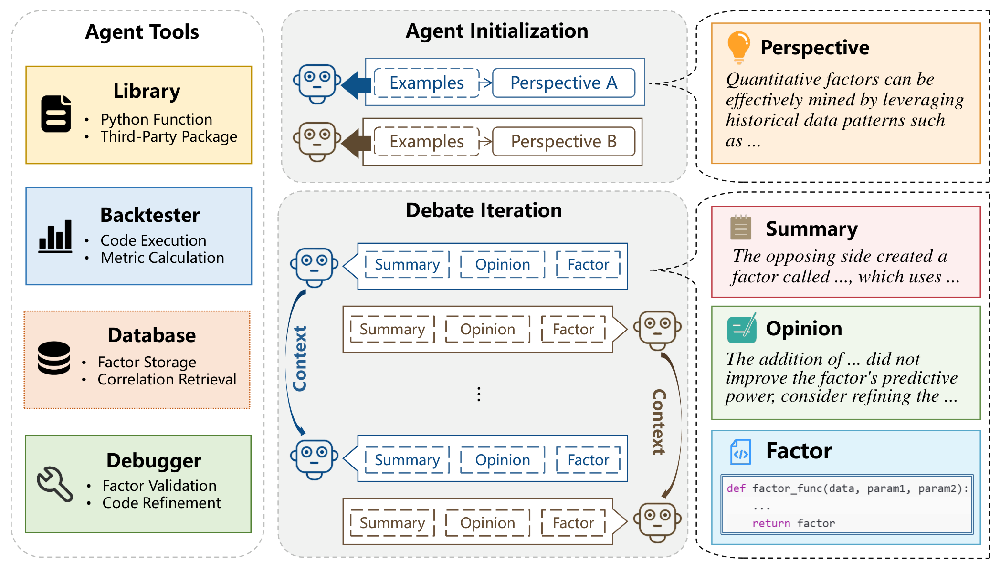
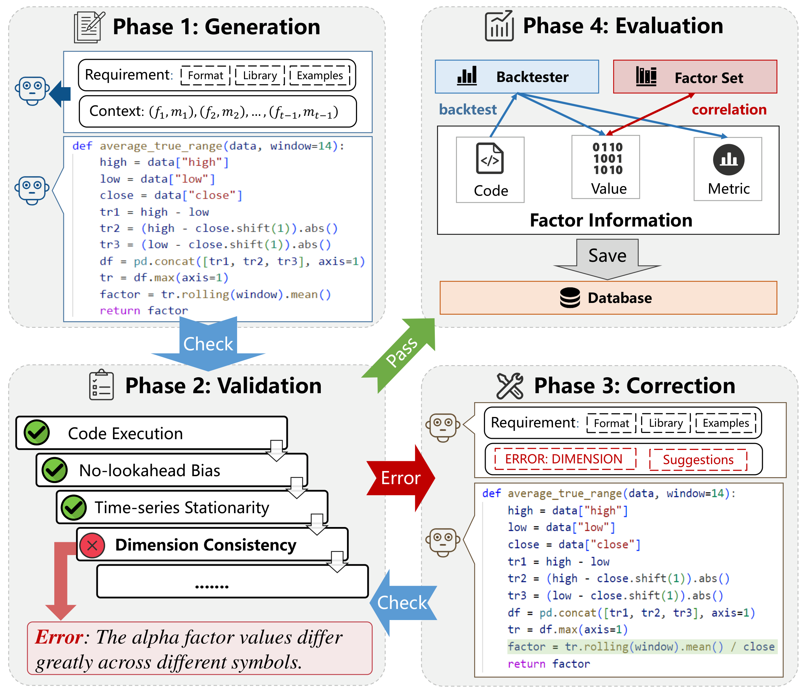

# skill-factormad-debate-factor-mining

**简体中文** | [English](README.en.md)

> **论文参考 / Paper Reference**
>
> 本项目的 FactorMAD-style 多智能体辩论式因子挖掘流程参考自：
> Duan, Y., Zhang, C., and Li, J. **FactorMAD: A Multi-Agent Debate Framework Based on Large Language Models for Interpretable Stock Alpha Factor Mining**. In *Proceedings of the 6th ACM International Conference on AI in Finance (ICAIF '25)*, pp. 605-613. ACM, 2025. DOI: [10.1145/3768292.3770377](https://dl.acm.org/doi/10.1145/3768292.3770377)
>
> 本仓库是面向 Codex / QUANTSKILLS 的自包含工程化实现，非论文官方代码；实现细节、输入输出格式和运行环境等与论文原始实验可能不同。

下图用于简要说明论文中的 FactorMAD 整体框架和代码型因子生成流程。

<p align="center">
  
</p>

<p align="center">
  
</p>

不是因子库，也不是回测引擎，而是一个**FactorMAD 风格的 LLM 多智能体辩论式因子挖掘 Skill**：把“生成一个代码型股票 Alpha 因子”拆成可运行、可检查、可归档的标准流程。

`role: skill` `platform: codex` `category: tooling` `status: active` `validation: runnable` `output: factor-candidates` `paradigm: llm multi-agent debate`


---

`skill-factormad-debate-factor-mining` 是一个自包含的 QUANTSKILLS 社区 Skill。它参考 FactorMAD 论文中的核心思想：让两个 LLM Agent 围绕候选因子进行结构化辩论、批评、修正，并把候选因子输出为可执行 Python 函数，而不是限制在预定义算子集合里。

本仓库提供的是一套研究工作流：从 OHLCV 行情数据出发，生成候选因子代码，做基础代码检查和轻量 Pearson IC、RankIC 与 ICIR 类评估，然后输出可审计 JSON 产物。

## 这个 Skill 解决什么问题

自动化因子挖掘常见的失败模式包括：

- **只给公式不给代码**：表达式难以直接接入研究流水线
- **LLM 一次性生成后无人批评**：缺少反方视角和迭代修正
- **代码能生成但不能跑**：NaN、inf、索引错位、零成交量、未来函数等问题没有被检查
- **结果不可追溯**：不知道每轮候选因子、辩论意见、筛选结果和最佳因子来自哪里
- **轻量指标被误用成最终回测**：Pearson IC、RankIC 与 ICIR 类指标只能做内部筛选，不能替代组合级验证

本 Skill 会提供：

- FactorMAD 风格的双 Agent 辩论流程
- 代码型因子生成，输出 Python function + arguments
- 基础 factor code debug / validation 检查
- 轻量 Pearson IC、RankIC 与 ICIR 类候选筛选
- 时间戳输出目录，保留每次运行的审计产物
- `dry_run` 模式，不调用 LLM 也能验证安装和输出

## 工作流

```text
1. 准备 OHLCV market_data.csv
2. 准备 input JSON，默认示例已使用 dry_run=true 做机械验证
3. 真实运行时复制示例配置，通过 `.env` 或 shell 环境变量设置 API key，并将 dry_run 改为 false
4. 两个 LLM Agent 生成、批评、修正候选因子
5. runtime 检查候选因子代码并计算轻量 Pearson IC、RankIC 与 ICIR 类指标
6. 输出 debate 记录、accepted factors 和 best factor
7. 后续用独立流程做样本外、交易成本、风险暴露和组合级回测
```

默认命令：

```bash
python scripts/factormad_debate_factor.py --input examples/debate_input.json
```

示例配置默认输出目录：

```text
outputs/debate_example/
```

如果没有在 input JSON 中设置 `output_dir`，默认输出目录为：

```text
outputs/debateYYYYMMDDHHMMSS/
```

## 输入要求

至少需要一个行情 CSV：

- 必须包含 `date`、`symbol`
- 真实因子评估必须包含 `open`、`high`、`low`、`close`、`volume`
- `amount` 可选；缺失时 runtime 会用 `close * volume` 生成
- `vwap` 可选；缺失时 runtime 会用 `amount / volume` 生成；只有原始 CSV 已包含 `amount` 且存在 `adjfactor` 时，才会对生成的 `vwap` 做相应调整
- 数据必须是用户有权使用的数据
- `date` 建议使用 `YYYY-MM-DD` 或 pandas 可解析日期格式
- `symbol` 会作为截面分组键；同一交易日下应包含多个股票
- `label_config.price` 对应字段必须在 runtime 标准化后存在，例如 `vwap` 可由上述逻辑生成

示例输入文件：

```text
examples/debate_input.json
```

关键字段见：

```text
references/input_schema.md
```

真实 LLM 运行需要本地凭据。推荐复制 `.env.example`：

```bash
cp .env.example .env
# edit .env, fill OPENAI_API_KEY or FACTORMAD_OPENAI_API_KEY
```

也可以直接使用 shell 环境变量：

```bash
export OPENAI_API_KEY=...
export OPENAI_MODEL=gpt-4o-mini
export OPENAI_BASE_URL=https://api.openai.com/v1
```

读取优先级为 `FACTORMAD_OPENAI_*` > `OPENAI_*`；shell 中已 export 的变量不会被 `.env` 覆盖。`.env` 已被 `.gitignore` 排除，请不要提交真实凭据。

## 仓库内容

```text
skill-factormad-debate-factor-mining/
├── SKILL.md                            # Agent skill 入口
├── README.md / README.en.md            # 用户向介绍
├── requirements.txt                    # Python 运行依赖
├── examples/
│   ├── debate_input.json               # dry-run 示例输入
│   ├── toy_market_data.csv             # toy 行情数据
│   └── factormad_alpha_library/        # 脱敏示例因子库
├── references/
│   ├── source_boundary.md              # 数据与来源边界
│   ├── input_schema.md                 # 输入字段说明
│   ├── output_contract.md              # 输出产物契约
│   └── validation_notes.md             # 假设、限制与风险边界
├── scripts/
│   ├── factormad_debate_factor.py      # CLI 入口
│   └── factormad_runtime/              # 自包含 FactorMAD runtime
└── agents/
    └── openai.yaml                     # OpenAI / Codex metadata
```

## 快速开始

安装依赖：

```bash
python -m pip install -r requirements.txt
```

先跑 dry run，不调用 LLM：

```bash
python scripts/factormad_debate_factor.py \
  --input examples/debate_input.json
```

成功后会看到类似输出：

```json
{
  "ok": true,
  "dry_run": true,
  "debate_json_path": "outputs/debate_example/factormad_debate_result.json",
  "accepted_factors_path": "outputs/debate_example/accepted_factors.json"
}
```

如果需要固定目录，可以在命令行显式指定：

```bash
python scripts/factormad_debate_factor.py \
  --input examples/debate_input.json \
  --output outputs/debate
```

也可以写在 input JSON 里：

```json
{
  "output_dir": "outputs/debate_example"
}
```

优先级是 `--output` > `output_dir` > 默认时间戳目录。

真实挖掘前，建议先复制一份本地输入配置，避免直接覆盖示例：

```bash
cp examples/debate_input.json examples/my_debate_input.local.json
cp .env.example .env
# edit .env, fill OPENAI_API_KEY or FACTORMAD_OPENAI_API_KEY
```

然后将 `dry_run` 改为 `false`，并根据你的数据修改 `market_data_csv_path`、时间区间和标签配置：

```bash
python scripts/factormad_debate_factor.py \
  --input examples/my_debate_input.local.json
```

`*.local.json` 和 `.env` 已被 `.gitignore` 排除，不会进入仓库。

运行时会在终端持续打印进度，例如加载数据、评估 seed factors、初始化 debate job、每个 debate round 的状态、最终 accepted / invalid 计数。

## 输入变量说明

`examples/debate_input.json` 是 CLI 的主配置文件。数据与 seed 文件相对路径会优先按输入 JSON 所在目录解析，其次按仓库根目录解析；`output_dir` 相对路径按仓库根目录解析。

### 基础字段

| 字段 | 类型 | 说明 |
| --- | --- | --- |
| `market_data_csv_path` | string | 行情 CSV 路径。必须包含 `date`、`symbol`；真实运行需要 `open`、`high`、`low`、`close`、`volume`，`amount` 和 `vwap` 可由 runtime 补齐 |
| `dry_run` | boolean | 为 `true` 时只验证输入、路径和输出契约，不调用 LLM；真实挖掘设为 `false` |
| `output_dir` | string | 可选输出目录；不传命令行 `--output` 时使用，CLI 参数优先级更高 |
| `insample_time_range` | list[string, string] | 样本内区间，用于计算 `IC`、`ICIR` |
| `outsample_time_range` | list[string, string] | 样本外区间，用于计算 `O-IC`、`O-ICIR` |
| `test_debug_range` | list[string, string] | 因子代码 debug 时使用的检查区间，通常可设为较短区间；旧字段 `test_range` 仍兼容 |
| `test_symbols` | list[string] | debug 时检查的股票列表；空列表表示使用 CSV 中全部股票 |
| `demo_symbol` | string | 单股票示例符号；留空时由 runtime 自动处理 |

### 标签与因子目标

| 字段 | 类型 | 说明 |
| --- | --- | --- |
| `label_config.price` | string | 未来收益标签使用的价格列，例如 `close` 或 `vwap`。该列必须在 runtime 标准化后存在 |
| `label_config.span` | integer | 预测跨度，表示用未来多少期收益作为标签 |
| `label_config.preprocess` | string | 标签预处理方式。当前常用 `cs_zscore`，表示每日截面 z-score 标准化 |
| `factor_requirement` | string | 传给 LLM 的因子挖掘要求，可写市场、风格、禁用字段、研究约束等 |

`cs_zscore` 的含义是：在每个交易日截面上，对股票未来收益标签做去均值、除以标准差的标准化。它用于降低不同日期市场整体涨跌对 IC 评估的影响。

### Seed factors

| 字段 | 类型 | 说明 |
| --- | --- | --- |
| `examples` | list[object] | 内联 seed factors，每个元素包含 `code` 和 `arguments` |
| `seed_factors_json_path` | string | 外部 seed factors JSON 路径 |
| `seed_alphas_json_path` | string | 兼容旧命名的 seed alphas JSON 路径 |
| `agent_few_shots` | integer | 每个 Agent 初始化时抽取的 few-shot 因子数量 |

如果 `examples` 和 seed 文件都为空，runtime 会使用内置默认 seed factors。真实研究中建议维护自己的 seed factors，让 Agent 的初始风格更贴近你的市场和研究口径。

### Debate 控制变量

| 字段 | 类型 | 说明 |
| --- | --- | --- |
| `llm_name` | string | 模型名。留空时依次读取 `FACTORMAD_OPENAI_MODEL`、`OPENAI_MODEL`，再为空则使用 `gpt-4o-mini` |
| `debate_jobs` | integer | 独立 debate job 数量。首次真实运行建议设为 `1` |
| `debate_max_rounds` | integer | 每个 job 最多 debate 轮数 |
| `debate_max_tokens` | integer | 每组 Agent 对话的 token 上限 |
| `seed_metric_threshold` | number | 初始因子达到当前评价模式主指标阈值时可提前停止 |
| `factor_metric_threshold` | number | 旧字段，作为 `icir_threshold` 和 `rank_icir_threshold` 未设置时的兼容默认值 |
| `icir_threshold` | number | Pearson ICIR 通过阈值，`pearson_ic` 与 `hybrid` 模式使用 |
| `rank_icir_threshold` | number | RankICIR 通过阈值，`rank_ic` 与 `hybrid` 模式使用 |
| `factor_correlation_threshold` | number | 与已接受因子的相关性阈值，超过后会被视为相似 |
| `evaluation_mode` | string | 评价模式：`pearson_ic` 使用 Pearson ICIR；`rank_ic` 使用 RankICIR；`hybrid` 要求两者分别达标且方向一致 |
| `key_metric` | string | 旧字段，仅当未设置 `evaluation_mode` 时用于兼容推断；新配置不建议直接设置 |

首次真实运行建议保守设置：

```json
{
  "debate_jobs": 1,
  "debate_max_rounds": 2,
  "agent_few_shots": 3,
  "evaluation_mode": "pearson_ic",
  "icir_threshold": 0.05,
  "rank_icir_threshold": 0.05
}
```

确认流程稳定后，再逐步增加 `debate_jobs` 和 `debate_max_rounds`。`evaluation_mode` 会自动映射内部排序指标：`pearson_ic` 对应 `ICIR`，`rank_ic` 对应 `RankICIR`，`hybrid` 对应 `HybridICIR`。`hybrid` 不是加权分数，而是要求 Pearson ICIR 和 RankICIR 分别达标，并且两个指标根据样本内均值判断出的方向一致。

### 因子库变量

| 字段 | 类型 | 说明 |
| --- | --- | --- |
| `use_factormad_alpha_library` | boolean | 是否读取并更新本地 FactorMAD 因子库 |
| `few_shot_from_library` | boolean | 是否把因子库里的有效因子加入 Agent few-shot 初始化池 |
| `factormad_alpha_library_path` | string | 因子库 JSON 路径，留空时使用默认路径 |

`alpha_library_path` 是旧配置兼容字段，新配置建议只使用 `factormad_alpha_library_path`。

启用因子库的推荐配置：

```json
{
  "use_factormad_alpha_library": true,
  "few_shot_from_library": true,
  "factormad_alpha_library_path": "examples/factormad_alpha_library/my_library.local.json"
}
```

注意：因子库只会保存通过轻量筛选的有效因子，不会保存所有 invalid / similar 候选。本仓库只提交一个脱敏示例 `examples/factormad_alpha_library/library.json`；真实运行前建议复制到本地路径，避免把研究结果写回示例库。

## 环境变量

| 变量 | 必需 | 说明 |
| --- | --- | --- |
| `FACTORMAD_OPENAI_API_KEY` | 可选 | FactorMAD 专用 API key；优先于 `OPENAI_API_KEY` |
| `OPENAI_API_KEY` | 真实运行必需 | OpenAI 或 OpenAI 兼容服务的 API key |
| `FACTORMAD_OPENAI_MODEL` | 可选 | FactorMAD 专用默认模型；优先于 `OPENAI_MODEL` |
| `OPENAI_MODEL` | 可选 | 默认模型名；当 input JSON 的 `llm_name` 为空时使用 |
| `FACTORMAD_OPENAI_BASE_URL` | 可选 | FactorMAD 专用 OpenAI 兼容接口地址；优先于 `OPENAI_BASE_URL` |
| `OPENAI_BASE_URL` | 可选 | OpenAI 兼容接口地址 |
| `FACTORMAD_OUTPUT_DIR` | 自动设置 | CLI 会设置为本次输出目录 |
| `PANDA_SKILL_OUTPUT_DIR` | 自动设置 | 兼容旧 runtime 的输出目录变量 |
| `FACTORMAD_STABLE_OUTPUTS` | 自动设置 | 控制 CLI 写入稳定命名的输出文件 |

命令行示例：

```bash
cp .env.example .env
# edit .env

python scripts/factormad_debate_factor.py \
  --input examples/my_debate_input.local.json \
  --output outputs/debate_real_run
```

## 输出产物

当前示例配置会生成固定目录：

```text
outputs/debate_example/
├── factormad_debate_result.json
├── debate_rounds.json
└── accepted_factors.json
```

如果没有设置 `output_dir` 且未传 `--output`，则使用时间戳目录 `outputs/debateYYYYMMDDHHMMSS/`。

其中：

| 文件 | 用途 |
| --- | --- |
| `factormad_debate_result.json` | 主结果，包含 `best_factor`、`debate_rounds`、`accepted_factors`、计数和路径 |
| `debate_rounds.json` | 每轮 Agent 观点、候选因子、状态和错误记录 |
| `accepted_factors.json` | 当前 accepted set。真实运行时包含评估通过的 seed / library 因子，以及 debate 过程中新增的 effective 因子 |

主结果中的关键字段：

| 字段 | 说明 |
| --- | --- |
| `ok` | 本次运行是否成功产生可用结果 |
| `job_count` | debate job 数量 |
| `round_count` | 总 debate round 数量 |
| `generated_factors` | 所有 job 生成的候选因子，包含 effective、similar 和 invalid 候选 |
| `accepted_factors` | 当前 accepted set，包含评估通过的 seed / library 因子，以及新增 effective 因子 |
| `invalid_factors` | 未通过检查或与已有因子过于相似的候选 |
| `evaluation_mode` | 本次运行的评价模式：`pearson_ic`、`rank_ic` 或 `hybrid` |
| `key_metric` | 由 `evaluation_mode` 自动映射出的内部排序指标：`ICIR`、`RankICIR` 或 `HybridICIR` |
| `icir_threshold` / `rank_icir_threshold` | 进入 accepted set 时分别使用的 Pearson ICIR 与 RankICIR 阈值 |
| `best_factor` | 在 `generated_factors` 中按 `evaluation_mode` 对应内部指标排序后的最佳候选；不等同于最终可交易因子 |
| `metric_time_ranges` | 指标对应的样本区间说明 |
| `library_update` | 启用因子库时的写入统计 |
| `llm_fee` | runtime 估算的 LLM 调用费用 |

每个因子记录使用统一字段：

| 字段 | 说明 |
| --- | --- |
| `name` | 因子名称 |
| `code` | 可执行 Python 因子函数代码 |
| `entry_function` | 入口函数名 |
| `arguments` | 调用因子函数时使用的参数 |
| `metric` | `IC`、`ICIR`、`RankIC`、`RankICIR`、`HybridICIR`、`O-IC`、`O-ICIR`、`O-RankIC`、`O-RankICIR`、`O-HybridICIR` 指标 |
| `evaluation_mode` | 该因子使用的评价模式 |
| `pearson_direction` | Pearson IC 根据样本内均值确定的方向，取值为 `1` 或 `-1` |
| `rank_ic_direction` | RankIC 根据样本内均值确定的方向，取值为 `1` 或 `-1` |
| `direction_consistent` | Pearson IC 与 RankIC 的样本内方向是否一致，`hybrid` 模式必须为 `true` 才能通过 |
| `insample_time_range` | 样本内区间 |
| `outsample_time_range` | 样本外区间 |
| `status` | `effective`、`similar`、`invalid`、`dry_run` 等状态 |
| `job_index` | 该因子来自第几个 debate job |
| `round` | 该因子来自第几轮 debate |

## Codex 触发示例

```text
请使用 factormad-debate-factor-mining。
基于 examples/debate_input.json 执行一次 dry-run，并总结输出文件路径。
```

```text
请使用 factormad-debate-factor-mining。
我已经在 .env 配置好 LLM API。请读取 examples/my_debate_input.local.json，运行一次真实 FactorMAD debate factor mining，并告诉我 accepted_factors.json、debate_rounds.json 和 factormad_debate_result.json 的路径。
```

## 与其它 Skill 的关系

| 仓库 | 用途 |
| --- | --- |
| **skill-factormad-debate-factor-mining**（本仓库） | 通过 LLM 多智能体辩论生成代码型候选因子 |


## 项目状态与边界

- **项目状态**：Community Project，未经 QUANTSKILLS 官方审核、认证或背书
- **平台**：仅支持 Codex（`platforms: [codex]`）
- **数据来源**：本仓库只包含 toy data；真实数据由使用者自行提供，并由使用者负责数据许可与合规
- **核心假设**：日频 OHLCV 截面因子研究；轻量 Pearson IC、RankIC 与 ICIR 类指标用作候选筛选
- **已知限制**：不模拟交易成本、市场冲击、停牌流动性、行业/风格暴露、组合约束或真实成交细节
- **风险边界**：历史统计表现不代表未来表现；LLM 生成代码必须人工审查和独立验证
- **用途**：仅供量化研究、教育和方法论参考，不构成投资建议、交易信号或获利保证

## 注册表元数据

- Category: `tooling`
- Tags: `factormad`, `alpha-factor-mining`, `multi-agent`, `debate`, `factor-debug`
- Platform: `codex`
- Status: `activate`
- Validation level: `runnable`

## License

This project is licensed under the GNU General Public License v3.0. See [LICENSE](LICENSE).

## 🐼 PandaAI / QUANTSKILLS 社群

<div align="center">
  
  <br>
  <sub>扫码加入 PandaAI 社群，交流 QUANTSKILLS 技能、Agent 工作流与量化研究实践。</sub>
</div>
